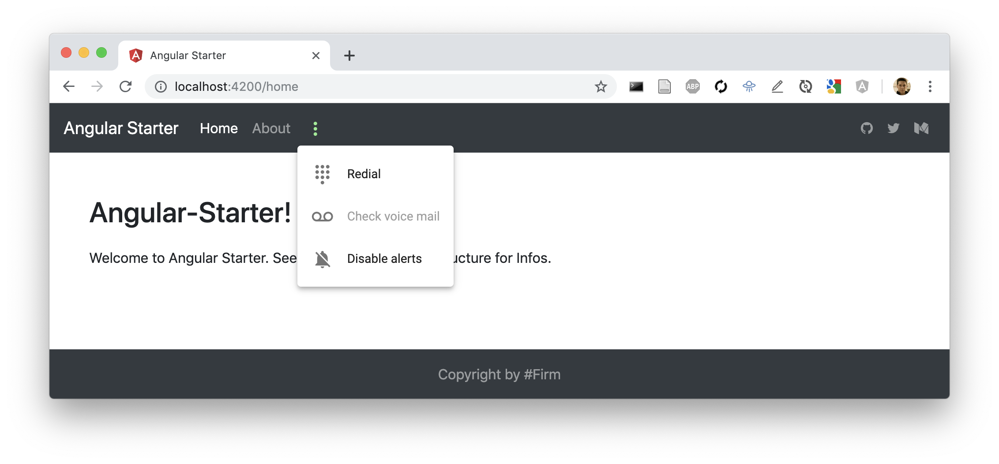

# Angular Starter
This Repo can be used as Angular starter and shows basic content-organization. First start a Angular Project with routing and scss. See file-structure for inputs on organization.



```
ng new angular-starter
cd angular-starter
```

### Installation
##### Setup Styles Dir
Move styles.scss in directory 'src/styles' and use as entry point. Also create:
- src/styles/_variables.scss
- src/styles/_mixins.scss
- src/styles/fonts.scss
- src/styles/general.scss

##### Install Bootstrap, Font-Awesome, Normalize SCSS
```
npm install bootstrap font-awesome normalize-scss
```


##### Set Paths in Angular.js
Set Paths in Angular.js
```
"architect": {
        "build": {
          "builder": "@angular-devkit/build-angular:browser",
          "options": {
            ...
            "styles": [
              "src/styles/styles.scss"
            ],
            "stylePreprocessorOptions": {
              "includePaths": [
                "./src/styles",
                "./node_modules/normalize-scss/sass"
              ]
            },
            ...
          },
```

##### Include Packages 
```
//styles.scss

//Import Bootstrap and Font-Awesome
@import "~bootstrap/dist/css/bootstrap.css";
@import "~font-awesome/css/font-awesome.css";

//Normalize SCSS
@import "normalize";
@include normalize();

//Import Files
@import'general';
@import 'fonts';
```


The Mixins and Variables need to be imported to every component
```
//app.component.scss

@import "variables";
@import "mixins";
```

##### Add Grid-Support for Autoprefixer
If Grid Support is needed place at top of app.component.scss
```
/* autoprefixer grid: no-autoplace */
```

##### Install Angular Material
If needed: Install Angular Material
```
ng add @angular/material
```

##### Structure of Project
```

├── app
│   ├── app-routing.module.ts
│   ├── app.component.html
│   ├── app.component.scss
│   ├── app.component.spec.ts
│   ├── app.component.ts
│   ├── app.module.ts
│   ├── layout
│   │   ├── layout.component.html
│   │   ├── layout.component.sass
│   │   ├── layout.component.spec.ts
│   │   └── layout.component.ts
│   ├── material.module.ts
│   ├── pages
│   │   ├── about
│   │   │   ├── about.component.html
│   │   │   ├── about.component.sass
│   │   │   ├── about.component.spec.ts
│   │   │   └── about.component.ts
│   │   └── landing
│   │       ├── landing.component.html
│   │       ├── landing.component.sass
│   │       ├── landing.component.spec.ts
│   │       └── landing.component.ts
│   └── shared
│       ├── footer
│       │   ├── footer.component.html
│       │   ├── footer.component.sass
│       │   ├── footer.component.spec.ts
│       │   └── footer.component.ts
│       └── navigation
│           ├── navigation.component.html
│           ├── navigation.component.sass
│           ├── navigation.component.spec.ts
│           └── navigation.component.ts
├── assets
│   └── images
├── browserslist
├── environments
│   ├── environment.prod.ts
│   └── environment.ts
├── favicon.ico
├── index.html
├── karma.conf.js
├── main.ts
├── polyfills.ts
├── styles
│   ├── _mixins.scss
│   ├── _variables.scss
│   ├── fonts.scss
│   ├── general.scss
│   └── styles.scss
├── test.ts
├── tsconfig.app.json
├── tsconfig.spec.json
└── tslint.json
```
## Angular Documentation

- Dev Server: Run `ng serve` for a dev server. Navigate to `http://localhost:4200/`. The app will automatically reload if you change any of the source files.

- Generate Component: Run `ng generate component component-name` to generate a new component. You can also use `ng generate directive|pipe|service|class|guard|interface|enum|module`.

- Build Project: Run `ng build` to build the project. The build artifacts will be stored in the `dist/` directory. Use the `--prod` flag for a production build.

- Run Unit Tests: Run `ng test` to execute the unit tests via [Karma](https://karma-runner.github.io).

- Run End to End Tests: Run `ng e2e` to execute the end-to-end tests via [Protractor](http://www.protractortest.org/).

- Further help: To get more help on the Angular CLI use `ng help` or go check out the [Angular CLI README](https://github.com/angular/angular-cli/blob/master/README.md).
